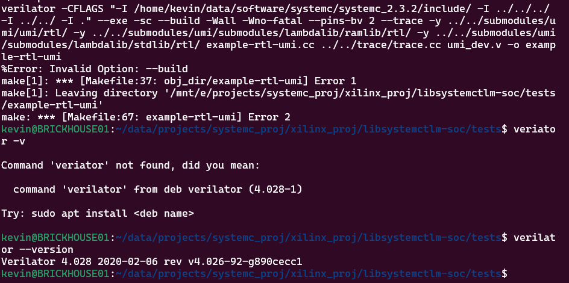
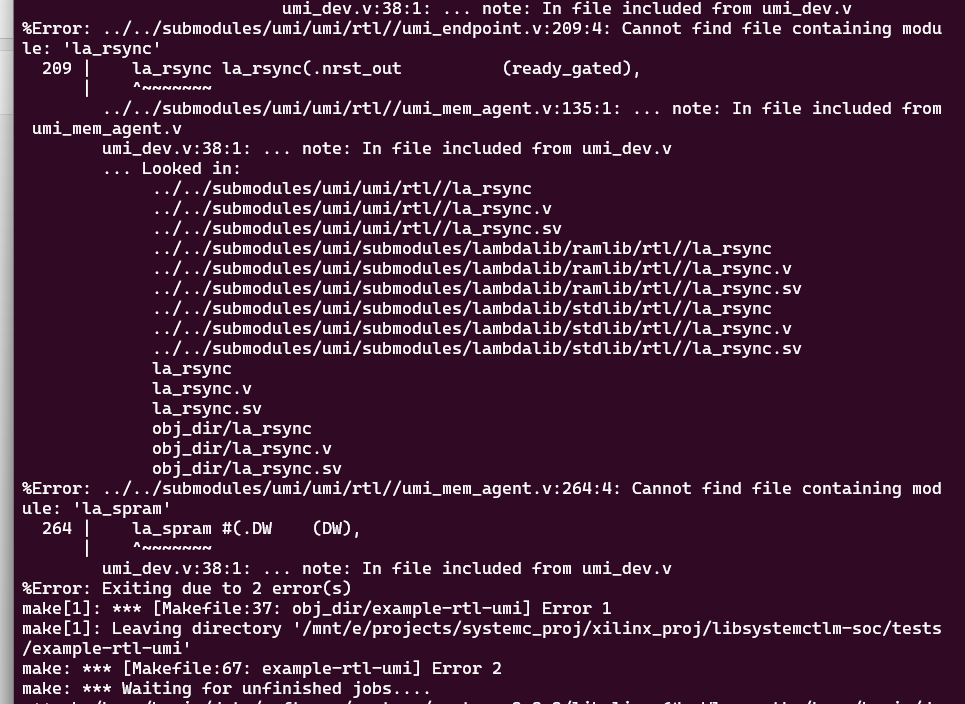
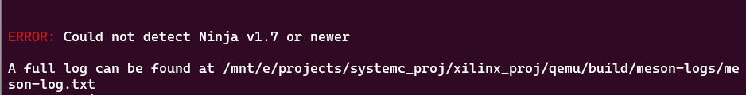
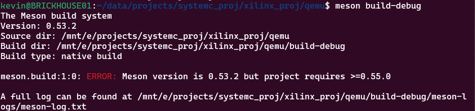
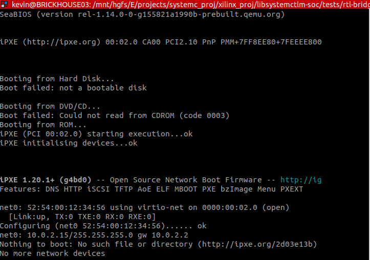

# Overview of Xilinx_SC_demo

Accroding the requirement of interview, there are two projects which have 5 cases in all. So I list the relevant codes and results of cases in `lab_libsystemctlm-soc  ` and `lab_systemctlm-cosim-demo`

#  Summary


## libsystemctlm-soc

CASE   | RESULT
-------- | -----
rtl-bridge/pcie/test_pcie_ep | TEST PASS
rtl-bridge/pcie/test-pcie-ep-master-vfio| TEST FAILED
rtl-bridge/pcie/refdesign-sim | TEST PASS


## systemctlm-cosim-demo

CASE   | RESULT
-------- | -----
pcie/versal/cpm5-qdma-demo | TEST PASS
pcie/versal/cpm4-qdma-demo | TEST PASS


# Note

1. refdesign-sim.vcd is compressed as refdesign-sim.vcd.tar.gz

# The problem and solution

## 环境搭建

### verilator安装提示生成结果有冲突

Configure and create Makefile，安装路径要和源文件路径不一样，因为源文件中有bin文件夹，安装会重新生成bin文件夹；若路径仍然一样，install时会报冲突
```
./configure  --prefix=<安装路径>    
# 设置 CXXFLAGS=-std=c++11 ./configure  --prefix=<安装路径>    
make -j `nproc`  # Build Verilator itself (if error, try just 'make')
make install

cp $VERILATOR_ROOT/include <安装路径> -r     // 安装路径中没有include文件夹
```


### verilator版本太旧，不识别-build选项

verilator 4.028不支持-build选项，改换成v5.024



### v5.024仿真编译时报错

查询网络说法推测新版本不稳定，后改用v4.110


### umi编译报错

发现umi仓库没有完全git clone下来，原因是umi仓库采用ssh的形式clone，全部clone下来编译成功



### qemu安装时ninja和meson版本不匹配

ninja和meson版本太旧，通过pip3 install安装





## 仿真运行

### qemu-system-x86_64: invalid accelerator kvm

wsl2-linux默认不支持kvm，需要升级wsl2-linux,升级时编译wsl2-linux遇到问题，转而使用vmware虚拟机ubuntu。

启动虚拟机之后仍报错，后来想到qemu自身也可能存在支持kvm的问题，因此查看编译命令后发现问题,qemu编译时configure应要--enable-kvm

### refdesign-sim没有输出结果

运行qemu后，没有仿真结果，本来推测是找不到hd0.qcow2来源，无法完成启动，但仔细阅读文献后，发现qemu存在监听端口，qemu可以和外界交互。



了解该测试用例后,该测试用例需在xilinx/qemu中运行，qemu和refdesign-sim测试用例通过remote-port连接，该组件是一个使用socket和共享内存在二者间输出事务的协议框架。

仿真时，qemu先运行，refdesign-sim后运行，refdesign-sim创建共享文件，qemu通过-machine-path指定路径监听到共享文件后开始运行。该测试目标只是实验qemu和systemc的协同仿真机制，通过hotplug判断设备是否被qemu识别，没有具体业务流。

### qemu的进入monitor窗口ctrl+a c，按c的时候不用按ctrl

这是个操作问题.